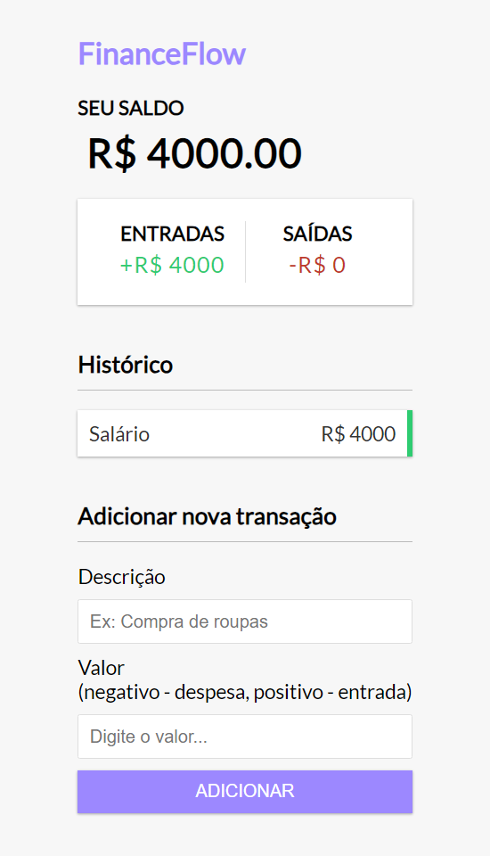

# FinanceFlow

Aplicação simples em Vue 3 utilizando Composition API para gerenciar finanças.

## Screenshot

### Instruções para rodar o aplicativo

1. Certifique-se que o Node.js está instalado
2. Clone o repositório
3. Abra o terminal na pasta raiz do projeto clonado
4. Execute o comando `npm install` para instalar as dependências
5. Execute o comando `npm run dev` para iniciar o servidor de desenvolvimento
6. Abra o navegador e acesse http://localhost:5173
